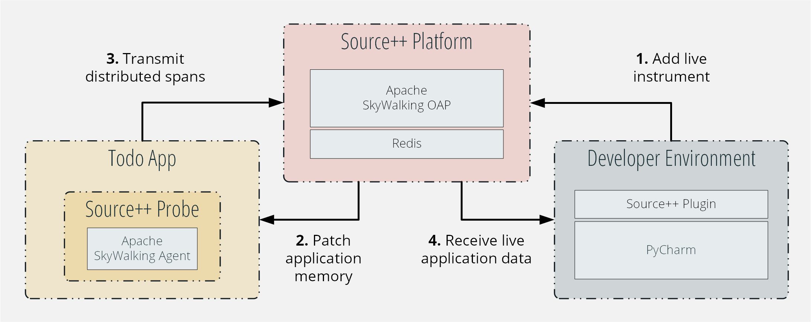
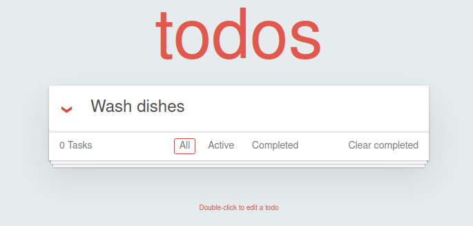

# Source++ tutorial for Python applications

[![License][license-image]][license-url]
[![Docs][docs-image]][docs-url]

A sample app for Python using [Source++](https://github.com/sourceplusplus/live-platform).



## Prerequisites

1. Git
2. Python 3
3. [Docker](https://docs.docker.com/engine/install)
4. [Docker Compose](https://docs.docker.com/compose/install/)
5. [PyCharm IDE](https://www.jetbrains.com/pycharm/)
    - PyCharm Community — 2020.2 — 2021.2.3
    - PyCharm Educational — 2020.2 — 2021.2.3
    - PyCharm Ultimate — 2020.2 — 2021.2.3

## Setup

1. Clone the sample app

```bash
git clone https://github.com/sourceplusplus/tutorial-python
cd tutorial-python
```

2. Boot live platform & start app

```bash
docker-compose up -d
```

3. Install Source++ Plugin

    <kbd>File</kbd> > <kbd>Settings</kbd> > <kbd>Plugins</kbd> > <kbd>Marketplace</kbd> > <kbd>Search for "Source++"</kbd> > <kbd>Install Plugin</kbd>

## Usage

Visit the sample app page at [http://localhost:8080/](http://localhost:8080/) and try to add a task to the todo list.



## Bug Hunt

Once you've successfully installed Source++ and can access the sample app, have some fun with our [bug hunt](bughunt-python.md) guide. Simply follow the instructions to try out some basic live-coding use cases.

## License

[Apache License 2.0](LICENSE)

[spp-getting-started]: https://docs.sourceplusplus.com/getting-started
[spp-signup]: https://www.sourceplusplus.com/
[license-url]: LICENSE
[docs-image]: https://img.shields.io/badge/docs-latest-blue.svg
[docs-url]: https://docs.sourceplusplus.com/
[license-image]: https://img.shields.io/badge/License-Apache%202.0-blue.svg
