# Python Bug Hunt

To help you learn how to utilize Source++, we've prepared a few manually introduced bugs.
These scenarios will make sure you understand how to create and use both live breakpoints and live logs for debugging live applications.

# Bug scenarios

## Level: Beginner

### Bug #1

**The bug:** <kbd>Clear completed</kbd> button does not work. When clicked - completed todos are not cleared.

#### Debug

1. Open the file `app.py`

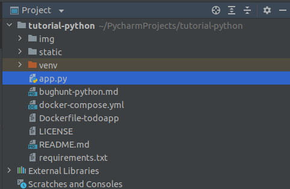

2. Navigate to the `clear_completed` function

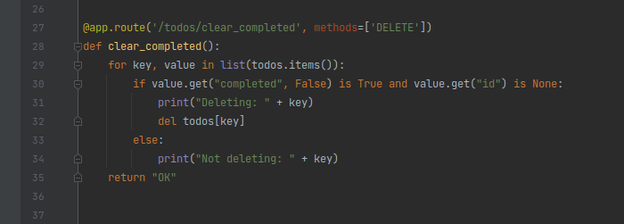

3. Place the keyboard cursor at line 32 and bring up the live control bar by typing the keyboard shortcut <kbd>Ctrl</kbd> + <kbd>Shift</kbd> + <kbd>S</kbd>

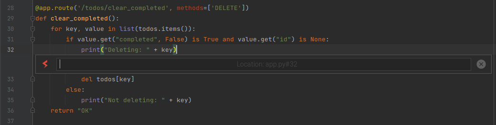

4. Type the `breakpoint` command and press enter

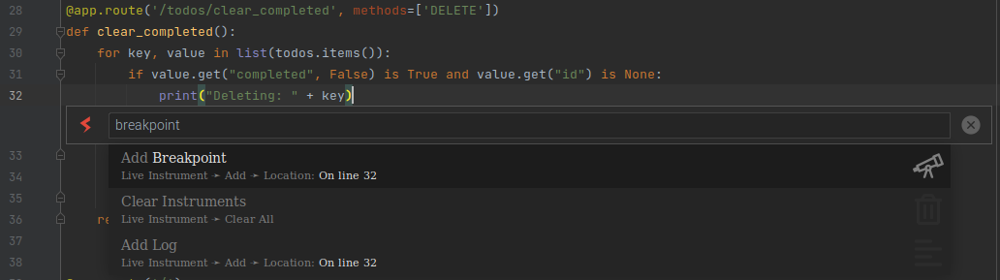

5. Press the enter key twice to create the live breakpoint with no condition and the default hit limit

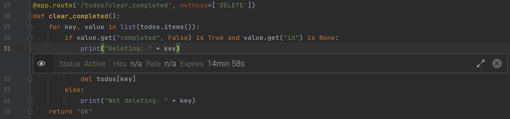

6. Repeat the previous three steps to create a live breakpoint on line 35

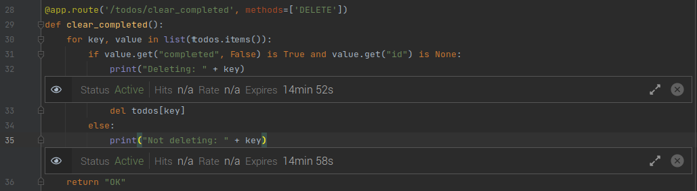

7. Add a todo and mark this todo completed using the checkbox on the left of the task

8. Click the <kbd>Clear completed</kbd> button in the bottom right corner

9. Navigate back to the `clear_completed` function and notice one of the live breakpoints is marked "Complete"

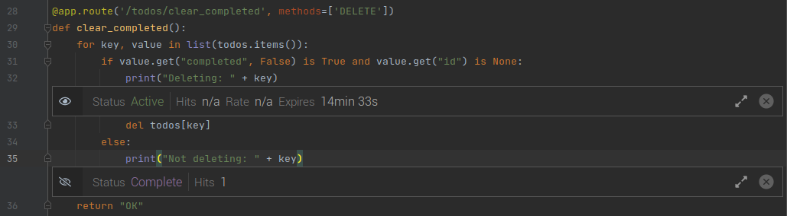

10. View the live breakpoint hits by expanding the breakpoint bar

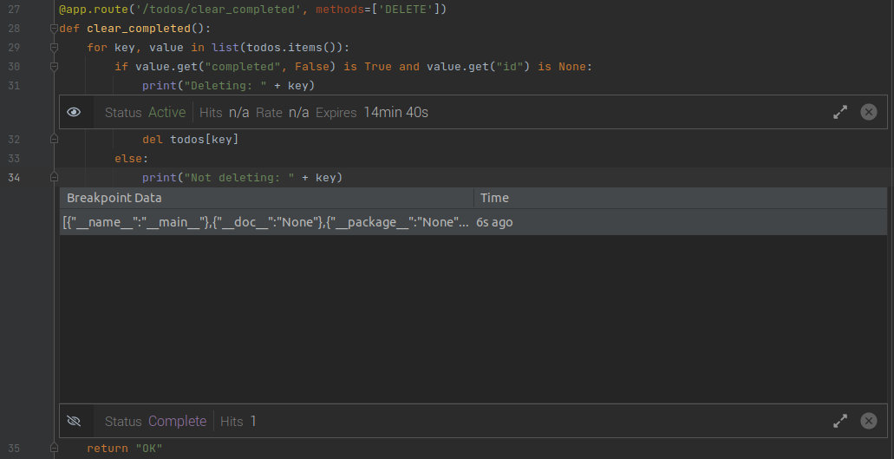

11. Click the live breakpoint hit to view collected live variables

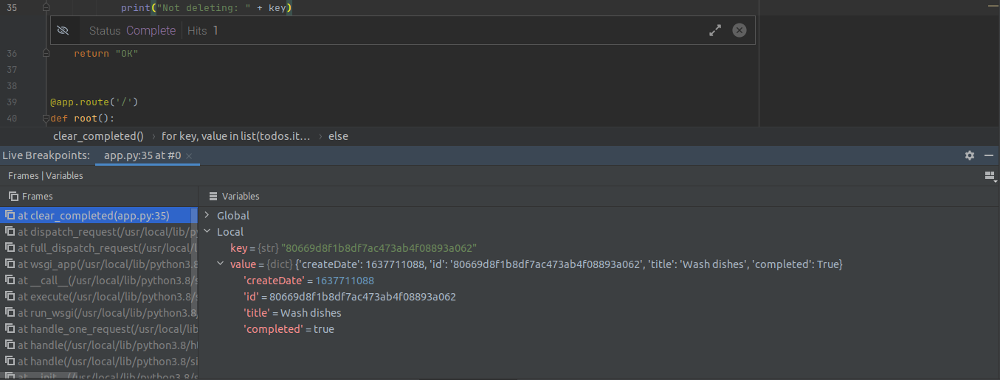

12. Notice the completed todo erroneously visits the "deleting" logic

13. Investigate why a completed todo would visit the "not deleting" logic opposed to the "deleting" logic

### Bug #2

**The bug:** Completed todos are not automatically deleted after five minutes.

#### Debug

1. Open the file `app.py`

2. Navigate to the `setup` function

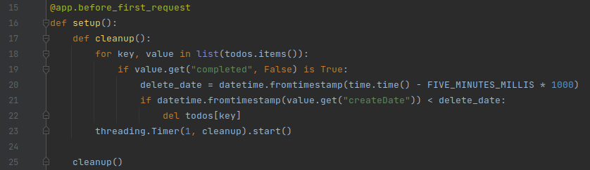

3. Place the keyboard cursor at line 30 and bring up the live control bar by typing the keyboard shortcut <kbd>Ctrl</kbd> + <kbd>Shift</kbd> + <kbd>S</kbd>

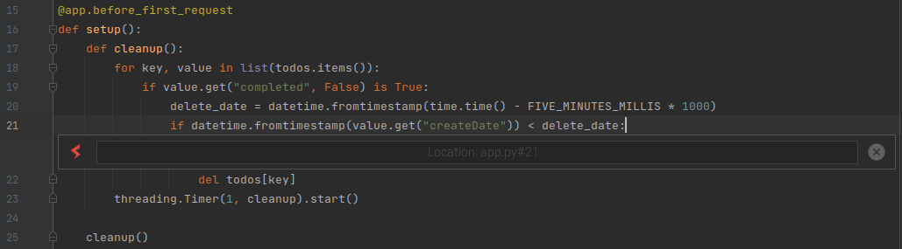

4. Type the `log` command and press enter

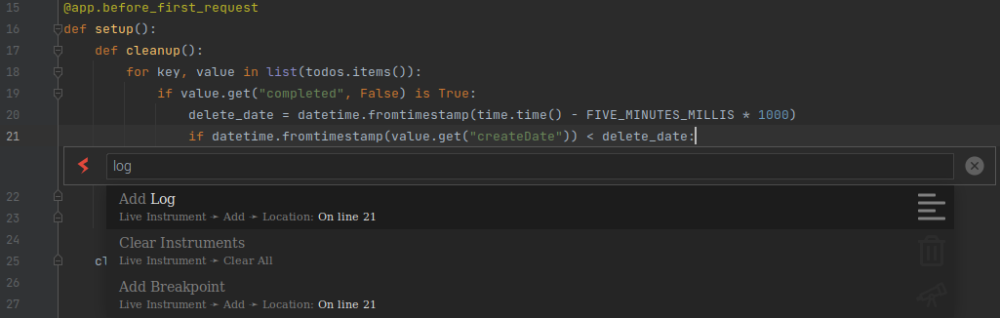

5. Type "Deleting todos older than: $deleteDate" and press enter

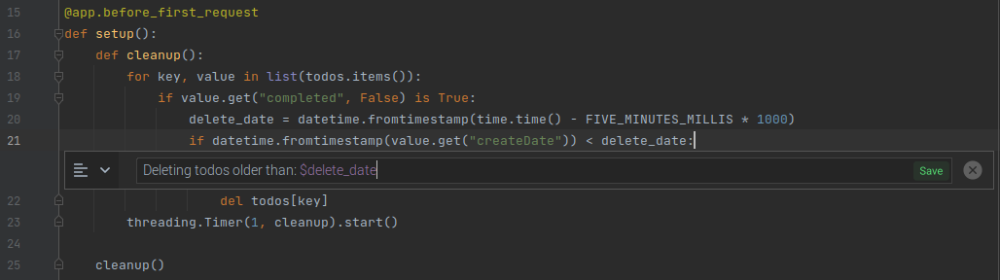

6. Notice the logged time and determine if it correlates to the desired time

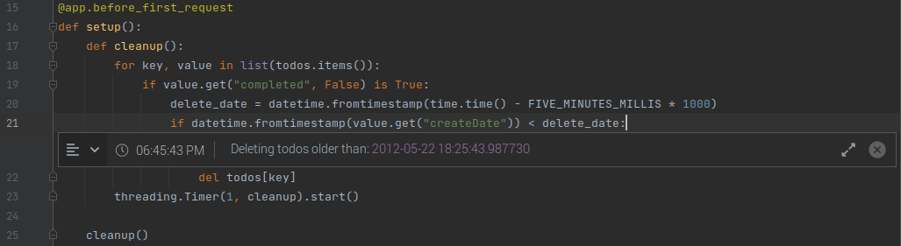

# Next steps

Head over to the [official documentation](https://docs.sourceplusplus.com/) to understand all the Source++ components.
